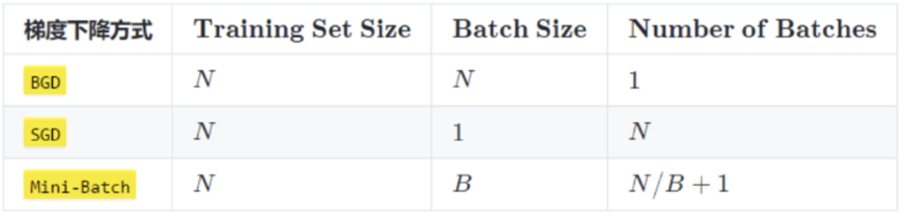
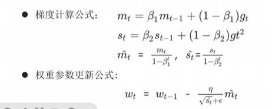

#  神经网络基础

## 神经网络

深度学习神经网络就是大脑仿生，数据从输入到输出经过一层一层的神经元产生预测值的过程就是==前向传播（也叫正向传播）==。

前向传播涉及到人工神经元是如何工作的（也就是神经元的初始化、激活函数），神经网络如何搭建，权重参数计算、数据形如何状变化。千里之行始于足下，我们一起进入深度学习的知识海洋吧。

###  神经网络概念

####  什么是神经网络

人工神经网络（Artificial Neural Network， 简写为**ANN**）也简称为神经网络（NN），是一种模仿生物神经网络结构和功能的**计算模型**。它由多个互相连接的人工神经元（也称为节点）构成，可以用于处理和学习复杂的数据模式，尤其适合解决非线性问题。人工神经网络是机器学习中的一个重要模型，尤其在深度学习领域中得到了广泛应用。

人脑可以看做是一个生物神经网络，由众多的**神经元**连接而成。各个神经元传递复杂的电信号，树突接收到**输入信号**，然后对信号进行处理，通过轴突**输出信号**。下图是生物神经元示意图：


当电信号通过树突进入到细胞核时，会逐渐聚集电荷。达到一定的电位后，细胞就会被激活，通过轴突发出电信号。

####  如何构建神经网络

神经网络是由多个神经元组成，构建神经网络就是在构建神经元。以下是神经网络中神经元的构建说明：


这个流程就像，来源不同树突(树突都会有不同的权重)的信息, 进行的加权计算, 输入到细胞中做加和，再通过激活函数输出细胞值。

同一层的多个神经元可以看作是通过并行计算来处理相同的输入数据，学习输入数据的不同特征。每个神经元可能会关注输入数据中的不同部分，从而捕捉到数据的不同属性。

接下来，我们使用多个神经元来构建神经网络，相邻层之间的神经元相互连接，并给每一个连接分配一个强度，如下图所示：


神经网络中信息只向一个方向移动，即从输入节点向前移动，通过隐藏节点，再向输出节点移动。其中的基本部分是:

1. **输入层（Input Layer）**: 即输入x的那一层（如图像、文本、声音等）。每个输入特征对应一个神经元。输入层将数据传递给下一层的神经元。
2. **输出层（Output Layer）**: 即输出y的那一层。输出层的神经元根据网络的任务（回归、分类等）生成最终的预测结果。
3. **隐藏层（Hidden Layers）**: 输入层和输出层之间都是隐藏层，神经网络的“深度”通常由隐藏层的数量决定。隐藏层的神经元通过加权和激活函数处理输入，并将结果传递到下一层。

==特点是：==

- 同一层的神经元之间没有连接
- 第N层的每个神经元和第N-1层的所有神经元相连（这就是Fully Connected的含义)，这就是**全连接神经网络（FCNN）**
- 全连接神经网络接收的样本数据是**二维的**，数据在每一层之间需要以二维的形式传递
- 第N-1层神经元的输出就是第N层神经元的输入
- 每个连接都有一个权重值（w系数和b系数）

####  神经网络内部状态值和激活值


每一个神经元工作时，**前向传播**会产生两个值，**内部状态值（加权求和值）**和**激活值**；**反向传播**时会产生**激活值梯度**和**内部状态值梯度**。

- 内部状态值
  - 神经元或隐藏单元的内部存储值，它反映了当前神经元接收到的输入、历史信息以及网络内部的权重计算结果。
  - 每个输入$$x_i$$都有一个与之相乘的权重$$w_i​$$，表示每个输入信号的重要性。
  - z=w⋅x+b
    - w：权重矩阵
    - x：输入值
    - b：偏置

- 激活值
  - 通过激活函数（如 ReLU、Sigmoid、Tanh）对内部状态值进行非线性变换后得到的结果。激活值决定了当前神经元的输出。
  - a=f(z)
    - f：激活函数
    - z：内部状态值

通过控制每个神经元的内部状态值、激活值的大小；每一层的内部状态值的方差、每一层的激活值的方差可让整个神经网络工作的更好。

所以下面两个小结，我们将要学习神经元的激活函数，神经元的权重初始化。

###  激活函数

#### 网络非线性因素理解

> - 没有引入非线性因素的网络等价于使用一个线性模型来拟合
>
> - 通过给网络输出增加激活函数, 实现引入非线性因素, 使得网络模型可以逼近任意函数, 提升网络对复杂问题的拟合能力

**激活函数**用于对每层的**输出数据进行变换**, 进而为整个网络注入了**非线性因素**。此时, 神经网络就可以拟合各种曲线。如果不使用激活函数，整个网络虽然看起来复杂，其本质还相当于一种**线性模型**，如下公式所示:


另外通过图像可视化的形式理解：

<a href='http://playground.tensorflow.org/#activation=tanh&batchSize=10&dataset=circle&regDataset=reg-plane&learningRate=0.03&regularizationRate=0&noise=0&networkShape=4,2&seed=0.97420&showTestData=false&discretize=false&percTrainData=50&x=true&y=true&xTimesY=false&xSquared=false&ySquared=false&cosX=false&sinX=false&cosY=false&sinY=false&collectStats=false&problem=classification&initZero=false&hideText=false'>神经网络可视化</a>


我们发现增加激活函数之后, 对于线性不可分的场景，神经网络的拟合能力更强。

#### 常见激活函数

> 激活函数主要用来向神经网络中加入非线性因素，以解决线性模型表达能力不足的问题，它对神经网络有着极其重要的作用。我们的网络参数在更新时，使用的反向传播算法（BP），这就要求我们的激活函数必须可微。

##### Sigmoid 激活函数

激活函数公式：


激活函数求导公式：


sigmoid 激活函数的函数图像如下:


- 从sigmoid函数图像可以得到，sigmoid 函数可以将**任意的输入**映射到 **(0, 1)** 之间，当输入的值大致在**&lt;-6或者&gt;6**时，意味着输入任何值得到的激活值都是差不多的，这样会丢失部分的信息。比如：输入100和输入10000经过 sigmoid的激活值几乎都是等于1的，但是输入的数据之间相差100倍的信息就丢失了。

- 对于sigmoid函数而言，输入值在**[-6, 6]**之间输出值才会**有明显差异**，输入值在**[-3, 3]**之间才会**有比较好的效果**

- 通过上述导数图像，我们发现**导数数值范围是 (0, 0.25)**，当输入的值**&lt;-6或者&gt;6**时，sigmoid激活函数图像的**导数接近为 0**，此时**网络参数将更新极其缓慢，或者无法更新。**

- 一般来说，sigmoid网络在**5层之内**就会产生**梯度消失**现象。而且，该激活函数的激活值并不是以0为中心的，激活值总是偏向正数，导致梯度更新时，只会对某些特征产生相同方向的影响，所以在实践中这种激活函数使用的很少。**sigmoid函数一般只用于二分类的输出层**。

在 PyTorch中使用sigmoid函数的示例代码如下:

```python
import torch
import matplotlib.pyplot as plt

plt.rcParams['font.sans-serif'] = ['SimHei']  # 用来正常显示中文标签
plt.rcParams['axes.unicode_minus'] = False  # 用来正常显示负号

"""
绘制激活函数图像时出现以下提示，需要将anaconda3/Lib/site-packages/torch/lib目录下的libiomp5md.dll文件删除
OMP: Error #15: Initializing libiomp5md.dll, but found libiomp5md.dll already initialized.
"""

# 创建画布和坐标轴
_, axes = plt.subplots(1, 2)

# 函数图像
x = torch.linspace(-20, 20, 1000)
# 输入值x通过sigmoid函数转换成激活值y
y = torch.sigmoid(x)
axes[0].plot(x, y)
axes[0].grid()
axes[0].set_title('Sigmoid 函数图像')

# 导数图像
x = torch.linspace(-20, 20, 1000, requires_grad=True)
torch.sigmoid(x).sum().backward()

# x.detach():输入值x的ndarray数组
# x.grad:计算梯度，求导
axes[1].plot(x.detach(), x.grad)
axes[1].grid()
axes[1].set_title('Sigmoid 导数图像')

plt.show()
```

#####  Tanh 激活函数

Tanh叫做双曲正切函数，其公式如下：


激活函数求导公式: 


Tanh的函数图像、导数图像如下：


- 由上面的函数图像可以看到，Tanh函数将**输入映射到(-1, 1)之间**，图像以0为中心，激活值在0点对称，当输入的值大概**&lt;-3或者&gt;3** 时将被映射为-1或者1。**其导数值范围 (0, 1)**，当输入的值大概**&lt;-3或者&gt;3**时，其导数近似0。

- 与Sigmoid相比，它是**以0为中心的**，使得其收敛速度要比Sigmoid快，减少迭代次数。然而，从图中可以看出，Tanh两侧的导数也为0，同样会造成梯度消失。

- 若使用时可在**隐藏层使用tanh函数**，在**输出层使用sigmoid函数**。

在 PyTorch 中使用tanh函数的示例代码如下:

```python
import torch
import matplotlib.pyplot as plt

plt.rcParams['font.sans-serif'] = ['SimHei']  # 用来正常显示中文标签
plt.rcParams['axes.unicode_minus'] = False  # 用来正常显示负号
 
_, axes = plt.subplots(1, 2)

# 函数图像
x = torch.linspace(-20, 20, 1000)
y = torch.tanh(x)
axes[0].plot(x, y)
axes[0].grid()
axes[0].set_title('Tanh 函数图像')

# 导数图像
x = torch.linspace(-20, 20, 1000, requires_grad=True)
torch.tanh(x).sum().backward()

axes[1].plot(x.detach(), x.grad)
axes[1].grid()
axes[1].set_title('Tanh 导数图像')

plt.show()
```

#####  ReLU 激活函数

ReLU 激活函数公式如下：


激活函数求导公式: 


ReLU 的函数图像、导数图像如下：


- ReLU 激活函数将小于0的值映射为0，而大于0的值则保持不变，它更加重视正信号，而忽略负信号，这种激活函数运算更为简单，能够提高模型的训练效率。
- 当x<0时，ReLU导数为0，而当x>0时，则不存在饱和问题。所以，ReLU 能够在x>0时保持梯度不衰减，从而缓解梯度消失问题。然而，随着训练的推进，部分输入会落入小于0区域，导致对应权重无法更新。这种现象被称为“神经元死亡”。
- ReLU是目前==最常用的激活函数==。与sigmoid相比，RELU的优势是：
  - 采用sigmoid函数，计算量大（指数运算），反向传播求误差梯度时，计算量相对大；而采用Relu激活函数，整个过程的计算量节省很多 
  - sigmoid函数反向传播时，很容易就会出现梯度消失的情况，从而无法完成深层网络的训练；而采用relu激活函数，当输入的值>0时，梯度为1，不会出现梯度消失的情况 
  - Relu会使一部分神经元的输出为0，这样就造成了网络的稀疏性，并且减少了参数的相互依存关系，缓解了过拟合问题的发生

在 PyTorch 中使用ReLU函数的示例代码如下:

```python
import torch
import matplotlib.pyplot as plt

plt.rcParams['font.sans-serif'] = ['SimHei']  # 用来正常显示中文标签
plt.rcParams['axes.unicode_minus'] = False  # 用来正常显示负号

_, axes = plt.subplots(1, 2)

# 函数图像
x = torch.linspace(-20, 20, 1000)
y = torch.relu(x)
axes[0].plot(x, y)
axes[0].grid()
axes[0].set_title('Tanh 函数图像')

# 导数图像
x = torch.linspace(-20, 20, 1000, requires_grad=True)
torch.relu(x).sum().backward()

axes[1].plot(x.detach(), x.grad)
axes[1].grid()
axes[1].set_title('Tanh 导数图像')

plt.show()
```

##### SoftMax激活函数

softmax用于**多分类**过程中，它是二分类函数sigmoid在多分类上的推广，目的是**将多分类的结果以概率的形式展现出来**。

计算方法如下图所示：


SoftMax就是将网络输出的logits通过softmax函数，映射成为(0,1)的值，而这些值的累和为1（满足概率的性质），那么我们将它理解成概率，选取概率最大（也就是值对应最大的）节点，作为我们的预测目标类别。

在 PyTorch 中使用SoftMax函数的示例代码如下:

```python
import torch


scores = torch.tensor([0.2, 0.02, 0.15, 0.15, 1.3, 0.5, 0.06, 1.1, 0.05, 3.75])
# dim=0, 按行计算
probabilities = torch.softmax(scores, dim=0)
print(probabilities)
```

程序输出结果:

```python
tensor([0.0212, 0.0177, 0.0202, 0.0202, 0.0638, 0.0287, 0.0185, 0.0522, 0.0183,
        0.7392])
```

####  如何选择激活函数

> 除了上述的激活函数，还存在很多其他的激活函数，如下图所示:
>
> 

对于**隐藏层**:

1. 优先选择ReLU激活函数
2. 如果ReLu效果不好，那么尝试其他激活，如Leaky ReLu等。
3. 如果你使用了ReLU， 需要注意一下Dead ReLU问题，避免出现0梯度从而导致过多的神经元死亡。
4. 少使用sigmoid激活函数，可以尝试使用tanh激活函数

对于**输出层**:

1. 二分类问题选择sigmoid激活函数
2. 多分类问题选择softmax激活函数
3. 回归问题选择identity激活函数

### 参数初始化

我们在构建网络之后，网络中的参数是需要初始化的。我们需要初始化的参数主要有**权重**和**偏置**，**偏置一般初始化为0即可**，而对权重的初始化则会更加重要。

参数初始化的作用：

- **防止梯度消失或爆炸**：初始权重值过大或过小会导致梯度在反向传播中指数级增大或缩小。
- **提高收敛速度**：合理的初始化使得网络的激活值分布适中，有助于梯度高效更新。
- **保持对称性破除**：权重的初始化需要打破对称性，否则网络的学习能力会受到限制。

####  常见参数初始化方法

- **随机初始化**

  - 均匀分布初始化：权重参数初始化从区间均匀随机取值，默认区间为（0，1）。可以设置为在(-$$1\over\sqrt{d}$$,$$1\over\sqrt{d}$$)均匀分布中生成当前神经元的权重，其中d为神经元的输入数量。

    

  - 正态分布初始化：随机初始化从均值为0，标准差是1的高斯分布中取样，使用一些很小的值对参数W进行初始化

  - **优点**：能有效打破对称性

  - **缺点**：随机选择范围不当可能导致梯度问题

  - **适用场景**：浅层网络或低复杂度模型。隐藏层1-3层，总层数不超过5层。

- **全0初始化**：将神经网络中的所有权重参数初始化为0
  - **优点**：实现简单
  - **缺点**：无法打破对称性，所有神经元更新方向相同，无法有效训练
  - **适用场景**：几乎不使用，仅用于偏置项的初始化

- **全1初始化**：将神经网络中的所有权重参数初始化为1
  - **优点**：实现简单
  - **缺点**
    - 无法打破对称性，所有神经元更新方向相同，无法有效训练
    - 会导致激活值在网络中呈指数增长，容易出现梯度爆炸
  - **适用场景**
    - 测试或调试：比如验证神经网络是否能正常前向传播和反向传播
    - 特殊模型结构：某些稀疏网络或特定的自定义网络中可能需要手动设置部分参数为1
    - 偏置初始化：偶尔可以将偏置初始化为小的正值（如 0.1），但很少用1作为偏置的初始值

- **固定值初始化**：将神经网络中的所有权重参数初始化为某个固定值
  - **优点**：实现简单
  - **缺点**
    - 无法打破对称性，所有神经元更新方向相同，无法有效训练
    - 初始权重过大或过小可能导致梯度爆炸或梯度消失
  - **适用场景**
    - 测试或调试

- **kaiming初始化**，也叫做**HE初始化**：专为ReLU和其变体设计，考虑到ReLU激活函数的特性，对输入维度进行缩放
  - HE初始化分为正态分布的HE初始化、均匀分布的HE初始化
    - 正态分布的he初始化
      - w权重值从均值为0, 标准差为std中随机采样，std = `sqrt(2 / fan_in)`
      - std值越大，w权重值离均值0分布相对较广，计算得到的内部状态值有较大的正值或负值
    - 均匀分布的he初始化
      - 它从[-limit，limit] 中的均匀分布中抽取样本, `limit` 是 `sqrt(6 / fan_in)`
    - `fan_in` 输入神经元的个数，**当前层**接受的**来自上一层**的神经元的数量。简单来说，就是当前层接收多少个输入
  - **优点**：适合 ReLU，能保持梯度稳定
  - **缺点**：对非 ReLU 激活函数效果一般
  - **适用场景**：深度网络(10层及以上)，使用 ReLU、Leaky ReLU 激活函数

- **xavier初始化**，也叫做**Glorot初始化**：根据网络输入和输出的维度自动选择权重范围，使输入和输出的方差相同
  - xavier初始化分为正态分布的xavier初始化、均匀分布的xavier初始化
    - 正态化的Xavier初始化
      - w权重值从均值为0, 标准差为std中随机采样，std = `sqrt(2 / (fan_in + fan_out))`
      - std值越小，w权重值离均值0分布相对集中，计算得到的内部状态值有较小的正值或负值
    - 均匀分布的Xavier初始化
      - [-limit，limit] 中的均匀分布中抽取样本, limit 是 `sqrt(6 / (fan_in + fan_out))`
    - fan_in 是输入神经元个数，**当前层**接受的**来自上一层**的神经元的数量。简单来说，就是当前层接收多少个输入
    - fan_out 是输出神经元个数，**当前层**输出的神经元的数量，也就是当前层会传递给**下一层**的神经元的数量。简单来说，就是当前层会产生多少个输出。

  - **优点**：适用于Sigmoid、Tanh 等激活函数，解决梯度消失问题
  - **缺点**：对 ReLU 等激活函数表现欠佳
  - **适用场景**：深度网络(10层及以上)，使用 Sigmoid 或 Tanh 激活函数

```python
import torch.nn as nn


# 1. 均匀分布随机初始化
def test01():

    linear = nn.Linear(5, 3)
    # 从0-1均匀分布产生参数
    nn.init.uniform_(linear.weight)
    nn.init.uniform_(linear.bias)
    print(linear.weight.data)


# 2. 固定初始化
def test02():

    linear = nn.Linear(5, 3)
    nn.init.constant_(linear.weight, 5)
    print(linear.weight.data)


# 3. 全0初始化
def test03():

    linear = nn.Linear(5, 3)
    nn.init.zeros_(linear.weight)
    print(linear.weight.data)


# 4. 全1初始化
def test04():

    linear = nn.Linear(5, 3)
    nn.init.ones_(linear.weight)
    print(linear.weight.data)


# 5. 正态分布随机初始化
def test05():

    linear = nn.Linear(5, 3)
    nn.init.normal_(linear.weight, mean=0, std=1)
    print(linear.weight.data)


# 6. kaiming 初始化
def test06():

    # kaiming 正态分布初始化
    linear = nn.Linear(5, 3)
    nn.init.kaiming_normal_(linear.weight, nonlinearity='relu')
    print(linear.weight.data)

    # kaiming 均匀分布初始化
    linear = nn.Linear(5, 3)
    nn.init.kaiming_uniform_(linear.weight, nonlinearity='relu')
    print(linear.weight.data)


# 7. xavier 初始化
def test07():

    # xavier 正态分布初始化
    linear = nn.Linear(5, 3)
    nn.init.xavier_normal_(linear.weight)
    print(linear.weight.data)

    # xavier 均匀分布初始化
    linear = nn.Linear(5, 3)
    nn.init.xavier_uniform_(linear.weight)
    print(linear.weight.data)
```

####  如何选择参数初始化

- 激活函数的选择：根据激活函数的类型选择对应的初始化方法
  - **Sigmoid/Tanh**：xavier 初始化
  - **ReLU/Leaky ReLU**：kaiming 初始化

- 神经网络模型的深度
  - 浅层网络：随机初始化即可
  - 深层网络：需要考虑方差平衡，如 xavier 或 kaiming 初始化

###  神经网络搭建和参数计算

####  构建神经网络

在pytorch中定义深度神经网络其实就是层堆叠的过程，继承自nn.Module，实现两个方法：

- `__init__`方法中定义网络中的层结构，主要是全连接层，并进行初始化
- forward方法，在调用神经网络模型对象的时候，底层会自动调用该函数。该函数中为初始化定义的layer传入数据，进行前向传播等。

接下来我们来构建如下图所示的神经网络模型：


**编码设计如下：**

- 第1个隐藏层：权重初始化采用标准化的xavier初始化 激活函数使用sigmoid
- 第2个隐藏层：权重初始化采用标准化的He初始化 激活函数采用relu
- out输出层线性层 假若多分类，采用softmax做数据归一化

**构造神经网络模型代码:**

```python
import torch
import torch.nn as nn
from torchsummary import summary  # 计算模型参数,查看模型结构, pip install torchsummary -i https://mirrors.aliyun.com/pypi/simple/


# 创建神经网络模型类
class Model(nn.Module):
    # 初始化属性值
    def __init__(self):
        # 调用父类的初始化属性值，确保nn.Module的初始化代码能够正确执行
        super(Model, self).__init__()
        # 创建第一个隐藏层模型, 3个输入特征,3个输出特征
        self.linear1 = nn.Linear(3, 3)
        # 初始化权重
        nn.init.xavier_normal_(self.linear1.weight)
        nn.init.zeros_(self.linear1.bias)
        # 创建第二个隐藏层模型, 3个输入特征(上一层的输出特征),2个输出特征
        self.linear2 = nn.Linear(3, 2)
        # 初始化权重
        nn.init.kaiming_normal_(self.linear2.weight, nonlinearity='relu')
        nn.init.zeros_(self.linear2.bias)
        # 创建输出层模型
        self.out = nn.Linear(2, 2)

	# 创建前向传播方法, 调用神经网络模型对象时自动执行forward()方法
    def forward(self, x):
        # 数据经过第一个线性层
        x = self.linear1(x)
        # 使用sigmoid激活函数
        x = torch.sigmoid(x)

        # 数据经过第二个线性层
        x = self.linear2(x)
        # 使用relu激活函数
        x = torch.relu(x)

        # 数据经过输出层
        x = self.out(x)
        # 使用softmax激活函数
        # dim=-1:每一维度行数据相加为1
        x = torch.softmax(x, dim=-1)

        return x
```

**训练神经网络模型代码:**

```python
# 创建构造模型函数
def train():
    # 实例化model对象
    my_model = Model()

    # 随机产生数据
    my_data = torch.randn(5, 3)
    print("my_data-->", my_data)
    print("my_data shape", my_data.shape)

    # 数据经过神经网络模型训练
    output = my_model(my_data)
    print("output-->", output)
    print("output shape-->", output.shape)

    # 计算模型参数
    # 计算每层每个神经元的w和b个数总和
    print("======计算模型参数======")
    summary(my_model, input_size=(3,), batch_size=5)
    
    # 查看模型参数
    print("======查看模型参数w和b======")
    for name, parameter in my_model.named_parameters():
        print(name, parameter)


if __name__ == '__main__':
    train()
```

####  观察数据形状变化

- 观察程序输入和输出的数据形状变化

  - 输入5行数据，输出也是5行数据
  - 输入5行数据3个特征，经过第一个隐藏层是3个特征，经过第二个隐藏层是2个特征，经过输出层是2个特征
  - 模型最终预测结果是：5行2列数据

  ```python
  mydata.shape---> torch.Size([5, 3])
  output.shape---> torch.Size([5, 2])
  mydata--->
    tensor([[-0.3714, -0.8578, -1.6988],
          [ 0.3149,  0.0142, -1.0432],
          [ 0.5374, -0.1479, -2.0006],
          [ 0.4327, -0.3214,  1.0928],
          [ 2.2156, -1.1640,  1.0289]])
  output--->
   tensor([[0.5095, 0.4905],
          [0.5218, 0.4782],
          [0.5419, 0.4581],
          [0.5163, 0.4837],
          [0.6030, 0.3970]], grad_fn=<SoftmaxBackward>)
  ```

####  模型参数计算

- 模型参数的计算

  - 以第一个隐层为例：该隐层有3个神经元，每个神经元的参数为：4个（w1,w2,w3,b1），所以一共用3x4=12个参数。 

  - 输入数据和网络权重是两个不同的事儿！对于初学者理解这一点十分重要，要分得清。

    

  ```python
  ----------------------------------------------------------------
          Layer (type)               Output Shape         Param #
  ================================================================
              Linear-1                     [5, 3]              12
              Linear-2                     [5, 2]               8
              Linear-3                     [5, 2]               6
  ================================================================
  Total params: 26
  Trainable params: 26
  Non-trainable params: 0
  ----------------------------------------------------------------
  Input size (MB): 0.00
  Forward/backward pass size (MB): 0.00
  Params size (MB): 0.00
  Estimated Total Size (MB): 0.00
  ----------------------------------------------------------------
  ```

####  查看模型参数

- 通常继承nn.Module，撰写自己的网络层。它强大的封装不需要我们定义可学习的参数（比如卷积核的权重和偏置参数）。

- 如何才能查看封装好的，可学习的网络参数哪？

  - 模块实例名.name_parameters（）,会分别返回name和parameter

  ```python
  # 实例化model对象
  mymodel = Model()
  
  # 查看网络参数
  for name, parameter in mymodel.named_parameters():
      # print('name--->', name)
      # print('parameter--->', parameter)
      print(name, parameter)
  ```

  **结果显示**

  ```python
  linear1.weight Parameter containing:
  tensor([[ 0.1715, -0.3711,  0.1692],
          [-0.2497, -0.6156, -0.4235],
          [-0.7090, -0.0380,  0.4790]], requires_grad=True)
  linear1.bias Parameter containing:
  tensor([-0.2320,  0.3431,  0.2771], requires_grad=True)
  linear2.weight Parameter containing:
  tensor([[-0.5044, -0.7435, -0.6736],
          [ 0.6908, -0.1466, -0.0019]], requires_grad=True)
  linear2.bias Parameter containing:
  tensor([0.2340, 0.4730], requires_grad=True)
  out.weight Parameter containing:
  tensor([[ 0.5185,  0.4019],
          [-0.4313, -0.3438]], requires_grad=True)
  out.bias Parameter containing:
  tensor([ 0.4521, -0.6339], requires_grad=True)
  ```

## 损失函数

###  损失函数概念

在深度学习中, 损失函数是用来==衡量模型参数质量的函数==, 衡量的方式**是比较网络输出（预测值）和真实输出（真实值）的差异。**

模型通过最小化损失函数的值来调整参数，使其输出更接近真实值。


损失函数在不同的文献中名称是不一样的，主要有以下几种**命名方式**：


**损失函数作用：**

- **评估性能**：反映模型预测结果与目标值的匹配程度。
- **指导优化**：通过梯度下降等算法最小化损失函数，优化模型参数。

### 分类任务损失函数

> 在深度学习的**分类任务**中使用最多的是**交叉熵损失函数**，所以在这里我们着重介绍这种损失函数。

#### 多分类任务损失函数

在多分类任务通常使用softmax将logits转换为概率的形式，所以多分类的交叉熵损失也叫做**softmax损失**，它的计算方法是：


其中:

- $$y_i$$是样本x属于某一个类别的真实概率(0%或100%)
- 而f(x)是样本属于某一类别的预测分数
- S是softmax激活函数，将属于某一类别的预测分数转换成概率
- L用来衡量真实值y和预测值f(x)之间差异性的损失结果

例子：


上图中的交叉熵损失为：


从概率角度理解，我们的目的是最小化正确类别所对应的预测概率的对数的负值(损失值最小)，如下图所示：


在PyTorch中使用`nn.CrossEntropyLoss()`实现，如下所示：

```python
import torch
from torch import nn


# 分类损失函数：交叉熵损失使用nn.CrossEntropyLoss()实现。nn.CrossEntropyLoss()=softmax+损失计算
def test01():
	# 设置真实值: 可以是热编码后的结果也可以不进行热编码
	# y_true = torch.tensor([[0, 1, 0], [0, 0, 1]], dtype=torch.float32)
	# 注意：类型必须是64位整型数据
	y_true = torch.tensor([1, 2], dtype=torch.int64)
	y_pred = torch.tensor([[0.2, 0.6, 0.2], [0.1, 0.8, 0.1]], requires_grad=True, dtype=torch.float32)
	# 实例化交叉熵损失，默认求平均损失
	# reduction='sum'：总损失
	loss = nn.CrossEntropyLoss()
	# 计算损失结果
	my_loss = loss(y_pred, y_true).detach().numpy()
	print('loss:', my_loss)
```

####  二分类任务损失函数

在处理二分类任务时，我们不再使用softmax激活函数，而是使用sigmoid激活函数，那损失函数也相应的进行调整，使用二分类的交叉熵损失函数：


其中:

- y是样本x属于某一个类别的真实概率

- 而$$\hat{y}$$是样本属于某一类别的预测概率

- L用来衡量真实值y与预测值$$\hat{y}$$之间差异性的损失结果。

  

在PyTorch中实现时使用`nn.BCELoss() `实现，如下所示：

```python
import torch
from torch import nn


def test02():
    # 1 设置真实值和预测值
    y_true = torch.tensor([0, 1, 0], dtype=torch.float32)
    # 预测值是sigmoid输出的结果
    y_pred = torch.tensor([0.6901, 0.5459, 0.2469], requires_grad=True)
    # 2 实例化二分类交叉熵损失
    loss = nn.BCELoss()
    # 3 计算损失
    my_loss = loss(y_pred, y_true).detach().numpy()
    print('loss：', my_loss)
```

### 回归任务损失函数

####  MAE损失函数

**mean absolute loss(MAE)**也被称为L1 Loss，是以绝对误差作为距离

损失函数公式:


曲线如下图所示：


特点是：

- 由于L1 loss具有稀疏性，为了惩罚较大的值，因此常常将其作为正则项添加到其他loss中作为约束。(0点不可导, 产生稀疏矩阵)
- L1 loss的最大问题是梯度在零点不平滑，导致会跳过极小值
- 适用于回归问题中存在异常值或噪声数据时，可以减少对离群点的敏感性

在PyTorch中使用`nn.L1Loss()`实现，如下所示：

```python
import torch
from torch import nn


# 计算inputs与target之差的绝对值
def test03():
    # 1 设置真实值和预测值
    y_pred = torch.tensor([1.0, 1.0, 1.9], requires_grad=True)
    y_true = torch.tensor([2.0, 2.0, 2.0], dtype=torch.float32)
    # 2 实例MAE损失对象
    loss = nn.L1Loss()
    # 3 计算损失
    my_loss = loss(y_pred, y_true).detach().numpy()
    print('loss:', my_loss)
```

####  MSE损失函数

**Mean Squared Loss/ Quadratic Loss(MSE loss)**也被称为L2 loss，或欧氏距离，它以误差的平方和的均值作为距离

损失函数公式:


曲线如下图所示：


特点是：

- L2 loss也常常作为正则项，对于离群点（outliers）敏感，因为平方项会放大大误差
- 当预测值与目标值相差很大时, 梯度容易爆炸
  - 梯度爆炸:网络层之间的梯度（值大于1.0）重复相乘导致的指数级增长会产生梯度爆炸

- 适用于大多数标准回归问题，如房价预测、温度预测等

在PyTorch中通过`nn.MSELoss()`实现：

```python
import torch
from torch import nn


def test04():
    # 1 设置真实值和预测值
    y_pred = torch.tensor([1.0, 1.0, 1.9], requires_grad=True)
    y_true = torch.tensor([2.0, 2.0, 2.0], dtype=torch.float32)
    # 2 实例MSE损失对象
    loss = nn.MSELoss()
    # 3 计算损失
    my_loss = loss(y_pred, y_true).detach().numpy()
    print('myloss:', my_loss)
```

#### Smooth L1损失函数

> smooth L1说的是光滑之后的L1，是一种结合了均方误差（MSE）和平均绝对误差（MAE）优点的损失函数。它在误差较小时表现得像 MSE，在误差较大时则更像 MAE。

Smooth L1损失函数如下式所示：


其中：`𝑥=f(x)−y` 为真实值和预测值的差值。


从上图中可以看出，该函数实际上就是一个分段函数

- 在[-1,1]之间实际上就是L2损失，这样解决了L1的不光滑问题
- 在[-1,1]区间外，实际上就是L1损失，这样就解决了离群点梯度爆炸的问题

特点是：

- **对离群点更加鲁棒**：当误差较大时，损失函数会线性增加（而不是像MSE那样平方增加），因此它对离群点的惩罚更小，避免了MSE对离群点过度敏感的问题

- **计算梯度时更加平滑**：与MAE相比，Smooth L1在小误差时表现得像MSE，避免了在训练过程中因使用绝对误差而导致的梯度不连续问题

在PyTorch中使用`nn.SmoothL1Loss()`计算该损失，如下所示：

```python
import torch
from torch import nn


def test05():
    # 1 设置真实值和预测值
    y_true = torch.tensor([0, 3])
    y_pred = torch.tensor([0.6, 0.4], requires_grad=True)
    # 2 实例smmothL1损失对象
    loss = nn.SmoothL1Loss()
    # 3 计算损失
    my_loss = loss(y_pred, y_true).detach().numpy()
    print('loss:', my_loss)
```

## 神经网络优化方法

多层神经网络的学习能力比单层网络强得多。想要训练多层网络，需要更强大的学习算法。误差反向传播算法（Back Propagation）是其中最杰出的代表，它是目前最成功的神经网络学习算法。现实任务使用神经网络时，大多是在使用 BP 算法进行训练，值得指出的是 BP 算法不仅可用于多层前馈神经网络，还可以用于其他类型的神经网络。通常说 BP 网络时，一般是指用 BP 算法训练的多层前馈神经网络。

这就需要了解两个概念：

1. **正向传播**：指的是数据通过网络从输入层到输出层的传递过程。这个过程的目的是计算网络的输出值（预测值），从而与目标值（真实值）比较以计算误差。
2. **反向传播**：指的是计算损失函数相对于网络中各参数（权重和偏置）的梯度，指导优化器更新参数，从而使神经网络的预测更接近目标值。

###  梯度下降算法回顾

**梯度下降法**简单来说就是一种**寻找使损失函数最小化的方法**。

从数学角度来看，**梯度的方向是函数增长速度最快的方向，那么梯度的反方向就是函数减少最快的方向**，所以有：


其中，η是学习率，如果学习率**太小**，那么每次训练之后得到的效果都太小，**增大训练的时间成本**。如果，学习率**太大**，那就有可能**直接跳过最优解**，进入无限的训练中。解决的方法就是，学习率也需要随着训练的进行而变化。


在上图中我们展示了一维和多维的损失函数，损失函数呈碗状。在训练过程中损失函数对权重的偏导数就是损失函数在该位置点的梯度。我们可以看到，沿着负梯度方向移动，就可以到达损失函数底部，从而使损失函数最小化。这种利用损失函数的梯度迭代地寻找最小值的过程就是梯度下降的过程。


**在进行模型训练时，有三个基础的概念：**

1. **Epoch**: 使用全部数据对模型进行以此完整训练，训练次数
2. **Batch**: 使用训练集中的小部分样本对模型权重进行以此反向传播的参数更新，每次训练每批次样本数量
3. **Iteration**: 使用一个 Batch 数据对模型进行一次参数更新的过程，每次训练批次数

假设数据集有 50000 个训练样本，现在选择 Batch Size = 256 对模型进行训练。
每个 Epoch 要训练的图片数量：50000 
训练集具有的 Batch 个数：50000/256+1=196
每个 Epoch 具有的 Iteration 个数：196 
10个 Epoch 具有的 Iteration 个数：1960

在深度学习中，**梯度下降的几种方式的根本区别就在于Batch Size不同**,如下表所示：



==注：上表中 Mini-Batch 的 Batch 个数为 N / B + 1 是针对未整除的情况。整除则是 N / B。==

### 反向传播（BP算法）

> 利用**反向传播算法**对神经网络进行训练。该方法与**梯度下降算法**相结合，对网络中所有权重**计算损失函数的梯度**，并利用梯度值来**更新权值**以最小化损失函数。

####  反向传播概念

**前向传播**：指的是数据输入到神经网络中，逐层向前传输，一直运算到输出层为止。

**反向传播（Back Propagation）**：利用损失函数ERROR值，从后往前，结合梯度下降算法，依次求各个参数的偏导，并进行参数更新。


在网络的训练过程中经过前向传播后得到的最终结果跟训练样本的真实值总是存在一定误差，这个误差便是损失函数 ERROR。想要减小这个误差，**就用损失函数 ERROR，从后往前，依次求各个参数的偏导，这就是反向传播（Back Propagation）**。

####  反向传播详解

**反向传播算法利用链式法则对神经网络中的各个节点的权重进行更新**。

【举个栗子🌰：】

如下图是一个简单的神经网络用来举例：**激活函数为sigmoid**


**前向传播运算**：


接下来是**反向传播**（求网络误差对各个权重参数的梯度）：

我们先来求最简单的，求误差E对w5的导数。首先明确这是一个**链式法则**的求导过程，要求误差E对w5的导数，需要先求误差E对$$out_{o1}$$的导数，再求$$out_{o1}$$对$$net_{o1}$$的导数，最后再求$$net_{o1}$$对$$w_5$$的导数，经过这个**链式法则**，我们就可以求出误差E对$$w_5$$的导数（偏导），如下图所示：


导数（梯度）已经计算出来了，下面就是**反向传播与参数更新过程**：


如果要想求**误差E对w1的导数**，误差E对w1的求导路径不止一条，这会稍微复杂一点，但换汤不换药，计算过程如下所示：


至此，**反向传播算法**的过程就讲完了啦！

### 梯度下降优化方法

梯度下降优化算法中，可能会碰到以下情况：

- 碰到平缓区域，梯度值较小，参数优化变慢
- 碰到 “鞍点” ，梯度为0，参数无法优化
- 碰到局部最小值，参数不是最优

对于这些问题, 出现了一些对梯度下降算法的优化方法，例如：**Momentum**、**AdaGrad**、**RMSprop**、**Adam** 等


####  指数加权平均

我们最常见的算数平均指的是将所有数加起来除以数的个数，每个数的权重是相同的。指数加权平均指的是给每个数赋予不同的权重求得平均数。移动平均数，指的是计算最近邻的 N 个数来获得平均数。

**指数移动加权平均**则是参考各数值，并且各数值的权重都不同，距离越远的数字对平均数计算的贡献就越小（权重较小），距离越近则对平均数的计算贡献就越大（权重越大）。

比如：明天气温怎么样，和昨天气温有很大关系，而和一个月前的气温关系就小一些。

计算公式可以用下面的式子来表示：


- $S_t$ 表示指数加权平均值;
- $Y_t$ 表示t时刻的值;
- β 调节权重系数，该值越大平均数越平缓。

**第100天的指数加权平均值为:**


**下面通过代码来看结果，随机产生 30 天的气温数据：**

```python
import torch
import matplotlib.pyplot as plt


ELEMENT_NUMBER = 30


# 1. 实际平均温度
def test01():

    # 固定随机数种子
    torch.manual_seed(0)
    # 产生30天的随机温度
    temperature = torch.randn(size=[ELEMENT_NUMBER,]) * 10
    print(temperature)
    # 绘制平均温度
    days = torch.arange(1, ELEMENT_NUMBER + 1, 1)
    plt.plot(days, temperature, color='r')
    plt.scatter(days, temperature)
    plt.show()


# 2. 指数加权平均温度
def test02(beta=0.9):
    
    # 固定随机数种子
    torch.manual_seed(0)
    # 产生30天的随机温度
    temperature = torch.randn(size=[ELEMENT_NUMBER,]) * 10
    print(temperature)

    exp_weight_avg = []
    # idx从1开始
    for idx, temp in enumerate(temperature, 1):
        # 第一个元素的 EWA 值等于自身
        if idx == 1:
            exp_weight_avg.append(temp)
            continue
        # 第二个元素的 EWA 值等于上一个 EWA 乘以 β + 当前气温乘以 (1-β)
        # idx-2：2-2=0，exp_weight_avg列表中第一个值的下标值
        new_temp = exp_weight_avg[idx - 2] * beta + (1 - beta) * temp
        exp_weight_avg.append(new_temp)

    days = torch.arange(1, ELEMENT_NUMBER + 1, 1)
    plt.plot(days, exp_weight_avg, color='r')
    plt.scatter(days, temperature)
    plt.show()


if __name__ == '__main__':
    test01()
    test02(0.5)
    test02(0.9)
```


**从程序运行结果可以看到：**

- 指数加权平均绘制出的气温变化曲线更加==平缓==
- β 的值越大，则绘制出的折线==越加平缓，波动越小==(1-β越小,t时刻的$S_t$越不依赖$Y_t$的值)
- β 值一般默认都是 0.9

####  动量算法Momentum

当梯度下降碰到 “峡谷” 、”平缓”、”鞍点” 区域时, 参数更新速度变慢。 Momentum 通过**指数加权平均法**，累计历史梯度值，进行参数更新，越近的梯度值对当前参数更新的重要性越大。

**梯度计算公式**：

​				$$s_t=βs_{t−1}+(1−β)g_t$$

**参数更新公式**：

​				$$w_t=w_{t−1}−ηs_t$$

$s_t$是当前时刻指数加权平均梯度值

$s_{t-1}$是历史指数加权平均梯度值

$g_t$是当前时刻的梯度值

β 是调节权重系数，通常取 0.9 或 0.99

η是学习率

$w_t$是当前时刻模型权重参数

```python
咱们举个例子，假设：权重 β 为 0.9，例如：
第一次梯度值：s1 = g1 = w1 
第二次梯度值：s2 = 0.9*s1 + g2*0.1 
第三次梯度值：s3 = 0.9*s2 + g3*0.1 
第四次梯度值：s4 = 0.9*s3 + g4*0.1 
1. w 表示初始梯度
2. g 表示当前轮数计算出的梯度值
3. s 表示历史梯度移动加权平均值

梯度下降公式中梯度的计算，就不再是当前时刻t的梯度值，而是历史梯度值的指数移动加权平均值。
公式修改为：
Wt = Wt-1 - η*St
Wt：当前时刻模型权重参数
St：当前时刻指数加权平均梯度值
η：学习率
```

Monmentum 优化方法是如何一定程度上克服 “平缓”、”鞍点”、”峡谷” 的问题呢？


- 当处于鞍点位置时，由于当前的梯度为 0，参数无法更新。但是 Momentum 动量梯度下降算法已经在先前积累了一些梯度值，很有可能使得跨过鞍点。
- 由于 mini-batch 普通的梯度下降算法，每次选取少数的样本梯度确定前进方向，可能会出现震荡，使得训练时间变长。Momentum 使用移动加权平均，平滑了梯度的变化，使得前进方向更加平缓，有利于加快训练过程。一定程度上有利于降低 “峡谷” 问题的影响。

在pytorch中动量梯度优化法编程实践如下：

```python
def test01():
    # 1 初始化权重参数
    w = torch.tensor([1.0], requires_grad=True, dtype=torch.float32)
    loss = ((w ** 2) / 2.0).sum()
    # 2 实例化优化方法：SGD 指定参数beta=0.9
    optimizer = torch.optim.SGD([w], lr=0.01, momentum=0.9)
    # 3 第1次更新 计算梯度，并对参数进行更新
    optimizer.zero_grad()
    loss.backward()
    optimizer.step()
    print('第1次: 梯度w.grad: %f, 更新后的权重:%f' % (w.grad.numpy(), w.detach().numpy()))
    # 4 第2次更新 计算梯度，并对参数进行更新
    # 使用更新后的参数机选输出结果
    loss = ((w ** 2) / 2.0).sum()
    optimizer.zero_grad()
    loss.backward()
    optimizer.step()
    print('第2次: 梯度w.grad: %f, 更新后的权重:%f' % (w.grad.numpy(), w.detach().numpy()))
```

**结果显示：**

```python
第1次: 梯度w.grad: 1.000000, 更新后的权重:0.990000
第2次: 梯度w.grad: 0.990000, 更新后的权重:0.971100
```

#### AdaGrad

AdaGrad 通过对不同的参数分量使用不同的学习率，**AdaGrad 的学习率总体会逐渐减小**，这是因为 AdaGrad 认为：在起初时，我们距离最优目标仍较远，可以使用较大的学习率，加快训练速度，随着迭代次数的增加，学习率逐渐下降。

其计算步骤如下：

1. 初始化学习率 η、初始化参数w、小常数 σ = 1e-10

2. 初始化梯度累计变量 s = 0
3. 从训练集中采样 m 个样本的小批量，计算梯度$g_t​$
4. **累积平方梯度**: $s_t​$ = $s_{t-1}​$ + $g_t​$ ⊙ $g_t​$，⊙ 表示各个分量相乘

5. 学习率 η 的计算公式如下：

      ​			η = $$η\over\sqrt{s_t}+σ$$

6. 权重参数更新公式如下：

      ​			$w_t$ = $$w_{t-1}$$ - $$η\over\sqrt{s_t}+σ$$ * $g_t$

7. 重复 3-7 步骤

**AdaGrad 缺点是可能会使得学习率过早、过量的降低，导致模型训练后期学习率太小，较难找到最优解。**

在PyTorch中AdaGrad优化法编程实践如下：

```python
def test02():
    # 1 初始化权重参数
    w = torch.tensor([1.0], requires_grad=True, dtype=torch.float32)
    loss = ((w ** 2) / 2.0).sum()
    # 2 实例化优化方法：adagrad优化方法
    optimizer = torch.optim.Adagrad([w], lr=0.01)
    # 3 第1次更新 计算梯度，并对参数进行更新
    optimizer.zero_grad()
    loss.backward()
    optimizer.step()
    print('第1次: 梯度w.grad: %f, 更新后的权重:%f' % (w.grad.numpy(), w.detach().numpy()))
    # 4 第2次更新 计算梯度，并对参数进行更新
    # 使用更新后的参数机选输出结果
    loss = ((w ** 2) / 2.0).sum()
    optimizer.zero_grad()
    loss.backward()
    optimizer.step()
    print('第2次: 梯度w.grad: %f, 更新后的权重:%f' % (w.grad.numpy(), w.detach().numpy()))
```

**结果显示：**

```python
第1次: 梯度w.grad: 1.000000, 更新后的权重:0.990000
第2次: 梯度w.grad: 0.990000, 更新后的权重:0.982965
```

####  RMSProp

**RMSProp 优化算法是对 AdaGrad 的优化**。最主要的不同是，其使用**指数加权平均梯度**替换历史梯度的平方和。

其计算过程如下：

1. 初始化学习率 η、初始化权重参数w、小常数 σ = 1e-10

2. 初始化梯度累计变量 s = 0

3. 从训练集中采样 m 个样本的小批量，计算梯度 $g_t$

4. 使用指数加权平均累计历史梯度，⊙ 表示各个分量相乘，公式如下：

      ​			$s_t$ = β$s_{t-1}$ + (1-β)$g_t$⊙$g_t$

5. 学习率 η 的计算公式如下：

      ​			η = $η\over\sqrt{s_t}+σ​$

6. 权重参数更新公式如下：

      ​			$w_t$ = $w_{t-1}$ - $η\over\sqrt{s_t}+σ$ * $g_t$

7. 重复 3-7 步骤

RMSProp 与 AdaGrad 最大的区别是对梯度的累积方式不同，对于每个梯度分量仍然使用不同的学习率。

**RMSProp 通过引入衰减系数β，控制历史梯度对历史梯度信息获取的多少**. 被证明在神经网络非凸条件下的优化更好，学习率衰减更加合理一些。

需要注意的是：AdaGrad 和 RMSProp 都是对于不同的参数分量使用不同的学习率，如果某个参数分量的梯度值较大，则对应的学习率就会较小，如果某个参数分量的梯度较小，则对应的学习率就会较大一些。

在PyTorch中RMSprop梯度优化法，编程实践如下：

```python
def test03():
    # 1 初始化权重参数
    w = torch.tensor([1.0], requires_grad=True, dtype=torch.float32)
    loss = ((w ** 2) / 2.0).sum()
    # 2 实例化优化方法：RMSprop算法，其中alpha对应beta
    optimizer = torch.optim.RMSprop([w], lr=0.01, alpha=0.9)
    # 3 第1次更新 计算梯度，并对参数进行更新
    optimizer.zero_grad()
    loss.backward()
    optimizer.step()
    print('第1次: 梯度w.grad: %f, 更新后的权重:%f' % (w.grad.numpy(), w.detach().numpy()))
    # 4 第2次更新 计算梯度，并对参数进行更新
    # 使用更新后的参数机选输出结果
    loss = ((w ** 2) / 2.0).sum()
    optimizer.zero_grad()
    loss.backward()
    optimizer.step()
    print('第2次: 梯度w.grad: %f, 更新后的权重:%f' % (w.grad.numpy(), w.detach().numpy()))
```

**结果显示：**

```python
第1次: 梯度w.grad: 1.000000, 更新后的权重:0.968377
第2次: 梯度w.grad: 0.968377, 更新后的权重:0.945788
```

####  Adam

- Momentum 使用指数加权平均计算当前的梯度值

- AdaGrad、RMSProp 使用自适应的学习率

- Adam优化算法（Adaptive Moment Estimation，自适应矩估计）将 Momentum 和 RMSProp 算法结合在一起
  - 修正梯度: 使⽤梯度的指数加权平均 
  - 修正学习率: 使⽤梯度平⽅的指数加权平均

- **原理**：Adam 是结合了 **Momentum** 和 **RMSProp** 优化算法的优点的自适应学习率算法。它计算了梯度的一阶矩（平均值）和二阶矩（梯度的方差）的自适应估计，从而动态调整学习率。

- **梯度计算公式**：



其中，m_t 是梯度的一阶矩估计，s_t 是梯度的二阶矩估计，$$ \hat{m_t}$$和 $$\hat{s_t}$$ 是偏差校正后的估计。

在PyTroch中，Adam梯度优化法编程实践如下：

```python
def test04():
    # 1 初始化权重参数
    w = torch.tensor([1.0], requires_grad=True)
    loss = ((w ** 2) / 2.0).sum()
    # 2 实例化优化方法：Adam算法，其中betas是指数加权的系数
    optimizer = torch.optim.Adam([w], lr=0.01, betas=[0.9, 0.99])
    # 3 第1次更新 计算梯度，并对参数进行更新
    optimizer.zero_grad()
    loss.backward()
    optimizer.step()
    print('第1次: 梯度w.grad: %f, 更新后的权重:%f' % (w.grad.numpy(), w.detach().numpy()))
    # 4 第2次更新 计算梯度，并对参数进行更新
    # 使用更新后的参数机选输出结果
    loss = ((w ** 2) / 2.0).sum()
    optimizer.zero_grad()
    loss.backward()
    optimizer.step()
    print('第2次: 梯度w.grad: %f, 更新后的权重:%f' % (w.grad.numpy(), w.detach().numpy()))
```

**结果显示：**

```python
第1次: 梯度w.grad: 1.000000, 更新后的权重:0.990000 
第2次: 梯度w.grad: 0.990000, 更新后的权重:0.980003
```

####  小结

| **优化算法** | **优点**                                            | **缺点**                                               | **适用场景**                                         |
| ------------ | --------------------------------------------------- | ------------------------------------------------------ | ---------------------------------------------------- |
| **SGD**      | 简单、容易实现。                                    | 收敛速度较慢，容易震荡，特别是在复杂问题中。           | 用于简单任务，或者当数据特征分布相对稳定时。         |
| **Momentum** | 可以加速收敛，减少震荡，特别是在高曲率区域。        | 需要手动调整动量超参数，可能会在小步长训练中过度更新。 | 用于非平稳优化问题，尤其是深度学习中的应用。         |
| **AdaGrad**  | 自适应调整学习率，适用于稀疏数据。                  | 学习率会在训练过程中逐渐衰减，可能导致早期停滞。       | 适合稀疏数据，如 NLP 或推荐系统中的特征。            |
| **RMSProp**  | 解决了 AdaGrad 学习率过早衰减的问题，适应性强。     | 需要选择合适的超参数，更新可能会过于激进。             | 适用于动态问题、非平稳目标函数，如深度学习训练。     |
| **Adam**     | 结合了 Momentum 和 RMSProp 的优点，适应性强且稳定。 | 需要调节更多的超参数，训练过程中可能会产生较大波动。   | 广泛适用于各种深度学习任务，特别是非平稳和复杂问题。 |

- **简单任务和较小的模型**：SGD 或 Momentum

- **复杂任务或有大量数据**：Adam 是最常用的选择，因其在大部分任务上都表现优秀

- **需要处理稀疏数据或文本数据**：Adagrad 或 RMSProp

## 学习率衰减优化方法

### 为什么要进行学习率优化

在训练神经网络时，一般情况下学习率都会随着训练而变化。这主要是由于，在神经网络训练的后期，如果**学习率过高，会造成loss的振荡**，但是如果**学习率减小的过慢，又会造成收敛变慢**的情况。

运行下面代码，观察学习率设置不同对网络训练的影响：

```python
import torch
import matplotlib.pyplot as plt

# x看成是权重，y看成是loss，下面通过代码来理解学习率的作用
def func(x_t):
    return torch.pow(2*x_t, 2)  # y = 4 x ^2

# 采用较小的学习率，梯度下降的速度慢
# 采用较大的学习率，梯度下降太快越过了最小值点，导致不收敛，甚至震荡
def dm01():

    x = torch.tensor([2.], requires_grad=True)
    # 记录loss迭代次数，画曲线
    iter_rec, loss_rec, x_rec = list(), list(), list()

    # 实验学习率： 0.01 0.02 0.03 0.1 0.2 0.3 0.4
    # lr = 0.1    # 正常的梯度下降
    # lr = 0.125      # 当学习率设置0.125 一下子求出一个最优解
                    # x=0 y=0 在x=0处梯度等于0 x的值x=x-lr*x.grad就不用更新了
                    # 后续再多少次迭代 都固定在最优点

    lr = 0.2      # x从2.0一下子跨过0点，到了左侧负数区域
    # lr = 0.3      # 梯度越来越大 梯度爆炸
    max_iteration = 4
    for i in range(max_iteration):
        y = func(x)   # 得出loss值
        y.backward()  # 计算x的梯度
        print("Iter:{}, X:{:8}, X.grad:{:8}, loss:{:10}".format(
            i, x.detach().numpy()[0], x.grad.detach().numpy()[0], y.item()))
        x_rec.append(x.item())      # 梯度下降点 列表
        # 更新参数
        x.data.sub_(lr * x.grad)    # x = x - x.grad
        x.grad.zero_()
        iter_rec.append(i)          # 迭代次数 列表
        loss_rec.append(y.item())  # 损失值 列表，这里将y改为y.item()以获取标量值
    # 迭代次数-损失值 关系图
    plt.subplot(121).plot(iter_rec, loss_rec, '-ro')
    plt.grid()
    plt.xlabel("Iteration X")
    plt.ylabel("Loss value Y")
    # 函数曲线-下降轨迹 显示图
    x_t = torch.linspace(-3, 3, 100)
    y = func(x_t)
    plt.subplot(122).plot(x_t.detach().numpy(), y.detach().numpy(), label="y = 4*x^2")
    y_rec = [func(torch.tensor(i)).item() for i in x_rec]
    print('x_rec--->', x_rec)
    print('y_rec--->', y_rec)
    # 指定线的颜色和样式（-ro：红色圆圈，b-：蓝色实线等）
    plt.subplot(122).plot(x_rec, y_rec, '-ro')
    plt.grid()
    plt.legend()
    plt.show()

dm01()
```

**运行效果图如下：**

可以看出：采用较小的学习率，梯度下降的速度慢；采用较大的学习率，梯度下降太快越过了最小值点，导致震荡，甚至不收敛（梯度爆炸）。


###  等间隔学习率衰减

等间隔学习率衰减方式如下所示：


在PyTorch中实现时使用：

```python
#   step_size：调整间隔数=50
#   gamma：调整系数=0.5
#   调整方式：lr = lr * gamma
optim.lr_scheduler.StepLR(optimizer, step_size, gamma=0.1)
```

具体使用方式如下：

```python
import torch
from torch import optim
import matplotlib.pyplot as plt


def test_StepLR():
    # 0.参数初始化
    LR = 0.1  # 设置学习率初始化值为0.1
    iteration = 10
    max_epoch = 200
    # 1 初始化参数
    y_true = torch.tensor([0])
    x = torch.tensor([1.0])
    w = torch.tensor([1.0], requires_grad=True)
    # 2.优化器
    optimizer = optim.SGD([w], lr=LR, momentum=0.9)
    # 3.设置学习率下降策略
    scheduler_lr = optim.lr_scheduler.StepLR(optimizer, step_size=50, gamma=0.5)
    # 4.获取学习率的值和当前的epoch
    lr_list, epoch_list = [], []
    for epoch in range(max_epoch):
        lr_list.append(scheduler_lr.get_last_lr()) # 获取当前lr
        epoch_list.append(epoch) # 获取当前的epoch
        for i in range(iteration):  # 遍历每一个batch数据
            loss = (w*x-y_true)**2  # 目标函数
            optimizer.zero_grad()
            # 反向传播
            loss.backward()
            optimizer.step()
        # 更新下一个epoch的学习率
        scheduler_lr.step()
    # 5.绘制学习率变化的曲线
    plt.plot(epoch_list, lr_list, label="Step LR Scheduler")
    plt.xlabel("Epoch")
    plt.ylabel("Learning rate")
    plt.legend()
    plt.show()	
```

###  指定间隔学习率衰减

指定间隔学习率衰减的效果如下：


在PyTorch中实现时使用：

```python
# milestones：设定调整轮次:[50, 125, 160]
# gamma：调整系数
# 调整方式：lr = lr * gamma
optim.lr_scheduler.MultiStepLR(optimizer, milestones, gamma=0.1, last_epoch=-1)    
```

具体使用方式如下所示：

```python
import torch
from torch import optim
import matplotlib.pyplot as plt


def test_MultiStepLR():
    torch.manual_seed(1)
    LR = 0.1
    iteration = 10
    max_epoch = 200
    y_true = torch.tensor([0])
    x = torch.tensor([1.0])
    w = torch.tensor([1.0], requires_grad=True)
    optimizer = optim.SGD([w], lr=LR, momentum=0.9)
    # 设定调整时刻数
    milestones = [50, 125, 160]
    # 设置学习率下降策略
    scheduler_lr = optim.lr_scheduler.MultiStepLR(optimizer, milestones=milestones, gamma=0.5)
    lr_list, epoch_list = list(), list()
    for epoch in range(max_epoch):
        lr_list.append(scheduler_lr.get_last_lr())
        epoch_list.append(epoch)
        for i in range(iteration):
            loss = (w*x-y_true)**2
            optimizer.zero_grad()
            # 反向传播
            loss.backward()
            # 参数更新
            optimizer.step()
        # 更新下一个epoch的学习率
        scheduler_lr.step()
    plt.plot(epoch_list, lr_list, label="Multi Step LR Scheduler\nmilestones:{}".format(milestones))
    plt.xlabel("Epoch")
    plt.ylabel("Learning rate")
    plt.legend()
    plt.show()
```

### 按指数学习率衰减

按指数衰减调整学习率的效果如下：


在PyTorch中实现时使用：

```python
# gamma：指数的底
# 调整方式
# lr= lr∗gamma^epoch
optim.lr_scheduler.ExponentialLR(optimizer, gamma)
```

具体使用方式如下所示：

```python
import torch
from torch import optim
import matplotlib.pyplot as plt


def test_ExponentialLR():
    # 0.参数初始化
    LR = 0.1  # 设置学习率初始化值为0.1
    iteration = 10
    max_epoch = 200
    # 1 初始化参数
    y_true = torch.tensor([0])
    x = torch.tensor([1.0])
    w = torch.tensor([1.0], requires_grad=True)
    # 2.优化器
    optimizer = optim.SGD([w], lr=LR, momentum=0.9)
    # 3.设置学习率下降策略
    gamma = 0.95
    scheduler_lr = optim.lr_scheduler.ExponentialLR(optimizer, gamma=gamma)
    # 4.获取学习率的值和当前的epoch
    lr_list, epoch_list = list(), list()
    for epoch in range(max_epoch):
        lr_list.append(scheduler_lr.get_last_lr())
        epoch_list.append(epoch)
        for i in range(iteration):  # 遍历每一个batch数据
            loss = (w*x-y_true)**2
            optimizer.zero_grad()
            # 反向传播
            loss.backward()
            optimizer.step()
        # 更新下一个epoch的学习率
        scheduler_lr.step()
    # 5.绘制学习率变化的曲线
    plt.plot(epoch_list, lr_list, label="Multi Step LR Scheduler")
    plt.xlabel("Epoch")
    plt.ylabel("Learning rate")
    plt.legend()
    plt.show()
```

### 小结

| 方法         | 等间隔学习率衰减 (Step Decay)    | 指定间隔学习率衰减 (Exponential Decay)     | 指数学习率衰减 (Exponential Moving Average Decay) |
| ------------ | -------------------------------- | ------------------------------------------ | ------------------------------------------------- |
| **衰减方式** | 固定步长衰减                     | 指定步长衰减                               | 平滑指数衰减，历史平均考虑                        |
| **实现难度** | 简单易实现                       | 相对简单，容易调整                         | 需要额外历史计算，较复杂                          |
| **适用场景** | 大型数据集、较为简单的任务       | 对训练平稳性要求较高的任务                 | 高精度训练，避免过快收敛                          |
| **优点**     | 直观，易于调试，适用于大批量数据 | 易于调试，稳定训练过程                     | 平滑且考虑历史更新，收敛稳定性较强                |
| **缺点**     | 学习率变化较大，可能跳过最优点   | 在某些情况下可能衰减过快，导致优化提前停滞 | 超参数调节较为复杂，可能需要更多的计算资源        |

## 正则化方法

###  什么是正则化


- 在设计机器学习算法时希望在新样本上的泛化能力强。许多机器学习算法都采用相关的策略来减小测试误差，这些策略被统称为正则化
- 神经网络强大的表示能力经常遇到过拟合，所以需要使用不同形式的正则化策略
- 目前在深度学习中使用较多的策略有范数惩罚，DropOut，特殊的网络层等，接下来我们对其进行详细的介绍

###  Dropout正则化

在训练深层神经网络时，由于模型参数较多，在数据量不足的情况下，很容易过拟合。Dropout（中文翻译成随机失活）是一个简单有效的正则化方法。


- 在训练过程中，Dropout的实现是**让神经元以超参数p（丢弃概率）的概率停止工作或者激活被置为0,未被置为0的进行缩放，缩放比例为1/(1-p)**。训练过程可以认为是对完整的神经网络的一些子集进行训练，每次基于输入数据只更新子网络的参数
- 在实际应用中，Dropout参数p的概率通常取值在0.2到0.5之间
  - 对于较小的模型或较复杂的任务，丢弃率可以选择0.3或更小
  - 对于非常深的网络，较大的丢弃率（如0.5或0.6）可能会有效防止过拟合
  - 实际应用中，通常会在全连接层（激活函数后）之后添加Dropout层
- **在测试过程中，随机失活不起作用**
  - 在测试阶段，使用所有的神经元进行预测，以获得更稳定的结果
  - 直接使用训练好的模型进行测试，由于所有的神经元都参与计算，输出的期望值会比训练阶段高。测试阶段的期望输出是 E[x_test] = x
  - 测试/推理模式：==model.eval()==
- **缩放的必要性**
  - 在训练阶段，将参与计算的神经元的输出除以(1-p)
  - 经过Dropout后的期望输出变为 E[x_dropout] = [(1-p) * x] / (1-p) = x，与测试阶段的期望输出一致
  - 训练模型：==model.train()==

我们通过一段代码观察下dropout的效果：

```python
import torch
import torch.nn as nn

def test():
    # 初始化随机失活层
    dropout = nn.Dropout(p=0.4)
    # 初始化输入数据:表示某一层的weight信息
    inputs = torch.randint(0, 10, size=[1, 4]).float()
    layer = nn.Linear(4,5)
    y = layer(inputs)
	y = torch.relu(y)
    print("未失活FC层的输出结果：\n", y)
    y =  dropout(y)
    print("失活后FC层的输出结果：\n", y)
```

**输出结果：**

```python
未失活FC层的输出结果：
 tensor([[0.0000, 1.8033, 1.4608, 4.5189, 6.9116]], grad_fn=<ReluBackward0>)
失活后FC层的输出结果：
 tensor([[0.0000,  3.0055,  2.4346,  7.5315, 11.5193]], grad_fn=<MulBackward0>)
```

上述代码将Dropout层的丢弃概率p设置为0.4，此时经过Dropout层计算的张量中就出现了很多0, 未变为0的按照（1/(1-0.4)）进行处理。

### 批量归一正则化(Batch Normalization)

在神经网络的训练过程中，流经网络的数据都是一个batch，每个batch之间的数据分布变化非常剧烈，==这就使得网络参数频繁的进行大的调整以适应流经网络的不同分布的数据==，给模型训练带来非常大的不稳定性，使得模型难以收敛。**如果我们对每一个batch的数据进行标准化之后，数据分布就变得稳定，参数的梯度变化也变得稳定，有助于加快模型的收敛。**

**通过标准化每一层的输入，使其均值接近0，方差接近1，从而加速训练并提高泛化能力。**


先对数据标准化，再对数据重构（缩放+平移），写成公式如下所示：


λ和β是可学习的参数，它相当于对标准化后的值做了一个**线性变换**，**λ为系数，β为偏置；**

eps 通常指为 1e-5，避免分母为 0；

E(x) 表示变量的均值；

Var(x) 表示变量的方差；


**批量归一化的步骤如下：**


**批量归一化的作用：**

- **减少内部协方差偏移：**通过对每层的输入进行标准化，减少了输入数据分布的变化，从而加速了训练过程，并使得网络在训练过程中更加稳定。

- **加速训练：**
  - 在没有批量归一化的情况下，神经网络的训练通常会很慢，尤其是深度网络。因为在每层的训练过程中，输入数据的分布（特别是前几层）会不断变化，这会导致网络学习速度缓慢。
  - 批量归一化通过确保每层的输入数据在训练时分布稳定，有效减少了这种变化，从而加速了训练过程。

- **起到正则化作用：**批量归一化可以视作一种正则化方法，因为它引入了对训练样本的噪声（不同批次的统计信息不同，批次较小的均值和方差估计会更加不准确），使得模型不容易依赖特定的输入特征，从而起到一定的正则化效果，减少了对其他正则化技术（如Dropout）的需求。

- **提升泛化能力：**由于其正则化效果，批量归一化能帮助网络在测试集上取得更好的性能。


==**批量归一化层在计算机视觉领域使用较多**==

**Batch Normalization 的使用步骤：**

1. **在网络层后添加 BN 层：**
   - 通常，BN 层会添加在卷积层 (Conv2d) 或全连接层 (Linear) 之后，**激活函数之前**。
   - 例如：Conv2d -> BN -> ReLU 或者 Linear -> BN -> ReLU。
2. **训练时：**==model.train()==
   - BN 层会计算当前批次的均值 $$μ$$ 和方差 $$σ²$$。
   - 然后，利用这两个统计量对当前批次的数据进行规范化。
   - 规范化后的数据会被缩放 $$γ$$ 和平移 $$β$$。
   - 同时，BN 层还会维护一个**全局均值**和**全局方差**的移动平均值，用于推理阶段。
3. **推理时：**==model.eval()==
   - 推理时，不会再使用当前批次的均值和方差，而是使用训练阶段计算的**全局均值**和**全局方差**。
   - 同样，规范化后的数据会被缩放 $$γ$$ 和平移 $$β$$。

```python
import torch
import torch.nn as nn

"""
BatchNorm1d：主要应用于全连接层或处理一维数据的网络，例如文本处理。它接收形状为 (N, num_features) 的张量作为输入。
BatchNorm2d：主要应用于卷积神经网络，处理二维图像数据或特征图。它接收形状为 (N, C, H, W) 的张量作为输入。
BatchNorm3d：主要用于三维卷积神经网络 (3D CNN)，处理三维数据，例如视频或医学图像。它接收形状为 (N, C, D, H, W) 的张量作为输入。
"""
    
def tes01():
    # 创建测试样本, 假设是经过卷积层(Conv2d)处理后的特征图
    # (N, C, H, W): 一张图, 两个通道, 每个通道3行4列
    # 可以创建1个样本, 图像的BN是对每个通道的特征图(行列数据)进行标准化
    input_2d = torch.randn(size=(1, 2, 3, 4))
    print("input-->", input_2d)
    # num_features：输入特征数
    # eps：非常小的浮点数，防止除以0的错误
    # momentum：动量系数
    # affine：默认为True，γ和β被使用，让BN层更加灵活
    bn2d = nn.BatchNorm2d(num_features=2, eps=1e-05, momentum=0.1, affine=True) 
    output = bn2d(input_2d)
    print("output-->", output)
    print(output.size())

    print(bn2d.weight)
    print(bn2d.bias)  

def tes02():
    # 创建测试样本
    # 2个样本, 1个特征
    # 不能创建1个样本, 无法统计均值和方差
    input_1d = torch.randn(size=(2, 2)) 
    # 创建线性层对象
    linear1 = nn.Linear(in_features=2, out_features=3)
    # 创建BN层对象
    # num_features：输入特征数
	bn1d = nn.BatchNorm1d(num_features=3)  # 20 output features
	output_1d = linear1(input_1d)
    # 进行批量归一化
	output = bn1d(output_1d) 
    print("output-->", output)
    print(output.size()) # (32, 20)
```

**输出结果：**

```python
test01:
input_2d--> tensor([[[[-0.2751, -1.2183, -0.5106, -0.1540],
          [-0.4585, -0.5989, -0.6063,  0.5986],
          [-0.4745,  0.1496, -1.1266, -1.2377]],

         [[ 0.2580,  1.2065,  1.4598,  0.8387],
          [-0.4586,  0.8938, -0.3328,  0.1192],
          [-0.3265, -0.6263,  0.0419, -1.2231]]]])
output--> tensor([[[[ 0.4164, -1.3889, -0.0343,  0.6484],
          [ 0.0655, -0.2032, -0.2175,  2.0889],
          [ 0.0349,  1.2294, -1.2134, -1.4262]],

         [[ 0.1340,  1.3582,  1.6853,  0.8835],
          [-0.7910,  0.9546, -0.6287, -0.0452],
          [-0.6205, -1.0075, -0.1449, -1.7779]]]],
       grad_fn=<NativeBatchNormBackward0>)
torch.Size([1, 2, 3, 4])
Parameter containing:
tensor([1., 1.], requires_grad=True)
Parameter containing:
tensor([0., 0.], requires_grad=True)

test02:
output--> tensor([[-0.9998,  1.0000,  1.0000],
        [ 0.9998, -1.0000, -1.0000]], grad_fn=<NativeBatchNormBackward0>)
torch.Size([2, 3])
```

## 手机价格分类案例

### 案例需求分析

小明创办了一家手机公司，他不知道如何估算手机产品的价格。为了解决这个问题，他收集了多家公司的手机销售数据。该数据为二手手机的各个性能的数据，最后根据这些性能得到4个价格区间，作为这些二手手机售出的价格区间。主要包括：


我们需要帮助小明找出手机的功能（例如：RAM等）与其售价之间的某种关系。我们可以使用机器学习的方法来解决这个问题，也可以构建一个全连接的网络。
需要注意的是: 在这个问题中，我们不需要预测实际价格，而是一个价格范围，它的范围使用 0、1、2、3 来表示，所以该问题也是一个分类问题。接下来我们还是按照四个步骤来完成这个任务：

- 准备训练集数据
- 构建要使用的模型
- 模型训练
- 模型预测评估

### 构建数据集

数据共有 2000 条, 其中 1600 条数据作为训练集, 400 条数据用作测试集。 我们使用 sklearn 的数据集划分工作来完成。并使用 PyTorch 的 TensorDataset 来将数据集构建为 Dataset 对象，方便构造数据集加载对象。

```python
# 导入相关模块
import torch
from torch.utils.data import TensorDataset
from torch.utils.data import DataLoader
import torch.nn as nn
from torchsummary import summary
import torch.optim as optim
from sklearn.model_selection import train_test_split
import numpy as np
import pandas as pd
import time

# 构建数据集
def create_dataset():
    # 使用pandas读取数据
    data = pd.read_csv('data/手机价格预测.csv')
    # 特征值和目标值
    x, y = data.iloc[:, :-1], data.iloc[:, -1]
    # 类型转换：特征值
    x = x.astype(np.float32)
    # 数据集划分
    x_train, x_valid, y_train, y_valid = train_test_split(x, y, train_size=0.8, random_state=88)
    # 构建数据集,转换为pytorch的形式
    train_dataset = TensorDataset(torch.from_numpy(x_train.values), torch.tensor(y_train.values))
    valid_dataset = TensorDataset(torch.from_numpy(x_valid.values), torch.tensor(y_valid.values))
    # 返回结果
    # x_train.shape[1]: 特征数
    # len(np.unique(y)): 类别数
    return train_dataset, valid_dataset, x_train.shape[1], len(np.unique(y))


if __name__ == '__main__':
    # 获取数据
    train_dataset, valid_dataset, input_dim, class_num = create_dataset()
    print("输入特征数：", input_dim)
    print("分类个数：", class_num)
```

输出结果为：

```python
输入特征数： 20 
分类个数： 4
```

### 构建分类网络模型

构建全连接神经网络来进行手机价格分类，该网络主要由三个线性层来构建，使用relu激活函数。
网络共有 3 个全连接层, 具体信息如下:
第一层: 输入为维度为 20, 输出维度为: 128
第二层: 输入为维度为 128, 输出维度为: 256
第三层: 输入为维度为 256, 输出维度为: 4

```python
# 构建网络模型
class PhonePriceModel(nn.Module):
	def __init__(self, input_dim, output_dim):
		super(PhonePriceModel, self).__init__()
		# 1. 第一层: 输入为维度为 20, 输出维度为: 128
		self.linear1 = nn.Linear(input_dim, 128)
		# 2. 第二层: 输入为维度为 128, 输出维度为: 256
		self.linear2 = nn.Linear(128, 256)
		# 3. 第三层: 输入为维度为 256, 输出维度为: 4
		self.linear3 = nn.Linear(256, output_dim)

	def forward(self, x):
		# 前向传播过程
		x = torch.relu(self.linear1(x))
		x = torch.relu(self.linear2(x))
        # 后续CrossEntropyLoss损失函数中包含softmax过程, 所以当前步骤不进行softmax操作
		output = self.linear3(x)
		# 获取数据结果
		return output
        
        
if __name__ == '__main__':
    train_dataset, valid_dataset, input_dim, class_num = create_dataset()
    # 模型实例化
    model = PhonePriceModel(input_dim, class_num)
    summary(model, input_size=(input_dim,), batch_size=16)
```


### 模型训练

网络编写完成之后，我们需要编写训练函数。所谓的训练函数，指的是输入数据读取、送入网络、计算损失、更新参数的流程，该流程较为固定。我们使用的是多分类交叉生损失函数、使用 SGD 优化方法。最终，将训练好的模型持久化到磁盘中。

```python
# 模型训练过程
def train(train_dataset,input_dim,class_num):
    # 固定随机数种子
    torch.manual_seed(0)
    # 初始化数据加载器
    dataloader = DataLoader(train_dataset, shuffle=True, batch_size=8)
    # 初始化模型
    model = PhonePriceModel(input_dim, class_num)
    # 损失函数  CrossEntropyLoss = softmax + 损失计算
    criterion = nn.CrossEntropyLoss()
    # 优化方法
    optimizer = optim.SGD(model.parameters(), lr=1e-3)
    # 训练轮数
    num_epoch = 50
    # 遍历每个轮次的数据
    for epoch_idx in range(num_epoch):
        # 训练时间
        start = time.time()
        # 计算损失
        total_loss = 0.0
        total_num = 0
        # 遍历每个batch数据进行处理
        for x, y in dataloader:
            # 将数据送入网络中进行预测
            model.train() # 使用训练模式
            output = model(x)
            # 计算损失
            loss = criterion(output, y)
            # 梯度清零
            optimizer.zero_grad()
            # 反向传播
            loss.backward()
            # 参数更新
            optimizer.step()
            # 损失计算
            total_num += 1
            total_loss += loss.item()
        # 打印损失变换结果
        print('epoch: %4s loss: %.2f, time: %.2fs' %(epoch_idx + 1, total_loss / total_num, time.time() - start))
    # 模型保存
    # state_dict(): 将模型的参数保存到字典中
    torch.save(model.state_dict(), 'model/phone-price-model.pth')
    

if __name__ == '__main__':    
    # 获取数据
    train_dataset, valid_dataset, input_dim, class_num = create_dataset()
    # 模型训练过程
    train(train_dataset,input_dim,class_num)
```


### 模型评估

使用训练好的模型，对未知的样本的进行预测的过程。我们这里使用前面单独划分出来的验证集来进行评估。

```python
def test(valid_dataset, input_dim, class_num):
    # 加载模型和训练好的网络参数
    model = PhonePriceModel(input_dim, class_num)
    # load_state_dict:将加载的参数字典应用到模型上
	# load:加载用来保存模型参数的文件
    model.load_state_dict(torch.load('model/phone-price-model.pth'))
    # 构建加载器
    dataloader = DataLoader(valid_dataset, batch_size=8, shuffle=False)
    # 评估测试集
    correct = 0
    # 遍历测试集中的数据
    for x, y in dataloader:
        # 将其送入网络中
        model.eval() # 使用推理模式 
        output = model(x)
        # 获取类别结果
        # argmax: 最大值对应的下标, 即类别编码
        y_pred = torch.argmax(output, dim=1)
        # 获取预测正确的个数
        correct += (y_pred == y).sum()
    # 求预测精度
    print('Acc: %.5f' % (correct.item() / len(valid_dataset)))
        
        
if __name__ == '__main__':
    # 获取数据
    train_dataset, valid_dataset, input_dim, class_num = create_dataset()
    # 模型预测结果
    test(valid_dataset, input_dim, class_num)
```

**输出结果：**

```python
Acc: 0.64250
```

###  网络性能优化

我们前面的网络模型在测试集的准确率为: 0.64250, 我们可以通过以下方面进行调优:

1. 对输入数据进行标准化
2. 调整优化方法
3. 调整学习率
4. 增加批量归一化层
5. 增加网络层数、神经元个数
6. 增加训练轮数
7. 等等...

进行下如下调整:

1. 优化方法由 SGD 调整为 Adam
2. 学习率由 1e-3 调整为 1e-4
3. 对数据进行标准化
4. 增加网络深度, 即: 增加网络参数量

```python
import torch
import torch.nn as nn
import pandas as pd
from sklearn.model_selection import train_test_split
from torch.utils.data import TensorDataset
from torch.utils.data import DataLoader
import torch.optim as optim
import numpy as np
import time
from sklearn.preprocessing import StandardScaler


# 构建数据集
def create_dataset():
	# 使用pandas读取数据
	data = pd.read_csv('./data/手机价格预测.csv')
	# 特征值和目标值
	x, y = data.iloc[:, :-1], data.iloc[:, -1]
	# 类型转换：特征值，目标值
	x = x.astype(np.float32)
	y = y.astype(np.int64)
	# 数据集划分
	x_train, x_valid, y_train, y_valid = train_test_split(x, y, train_size=0.8, random_state=88, stratify=y)
	# 优化①:数据标准化
	transfer = StandardScaler()
	x_train = transfer.fit_transform(x_train)
	x_valid = transfer.transform(x_valid)
	# 构建数据集,转换为pytorch的形式
	train_dataset = TensorDataset(torch.from_numpy(x_train), torch.tensor(y_train.values))
	valid_dataset = TensorDataset(torch.from_numpy(x_valid), torch.tensor(y_valid.values))
	# 返回结果
	return train_dataset, valid_dataset, x_train.shape[1], len(np.unique(y))


# 构建网络模型
class PhonePriceModel(nn.Module):

	def __init__(self, input_dim, output_dim):
		super(PhonePriceModel, self).__init__()
		# 优化②:增加网络深度
		# 1. 第一层: 输入为维度为 20, 输出维度为: 128
		self.linear1 = nn.Linear(input_dim, 128)
		# 2. 第二层: 输入为维度为 128, 输出维度为: 256
		self.linear2 = nn.Linear(128, 256)
		# 3. 第三层: 输入为维度为 256, 输出维度为: 512
		self.linear3 = nn.Linear(256, 512)
		# 4. 第四层: 输入为维度为 512, 输出维度为: 128
		self.linear4 = nn.Linear(512, 128)
		# 5. 输出层: 输入为维度为 128, 输出维度为: 4
		self.linear5 = nn.Linear(128, output_dim)

	def forward(self, x):
		# 前向传播过程
		x = torch.relu(self.linear1(x))
		x = torch.relu(self.linear2(x))
		x = torch.relu(self.linear3(x))
		x = torch.relu(self.linear4(x))
		# 后续CrossEntropyLoss损失函数中包含softmax过程, 所以当前步骤不进行softmax操作
		output = self.linear5(x)
		# 获取数据结果
		return output


# 编写训练函数
def train(train_dataset, input_dim, class_num):
	# 固定随机数种子
	torch.manual_seed(0)
	# 初始化数据加载器
	dataloader = DataLoader(train_dataset, shuffle=True, batch_size=8)
	# 初始化模型
	model = PhonePriceModel(input_dim, class_num)
	# 损失函数 CrossEntropyLoss = softmax + 损失计算
	criterion = nn.CrossEntropyLoss()
	# 优化③:使用Adam优化方法, 优化④:学习率变为1e-4
	optimizer = optim.Adam(model.parameters(), lr=1e-4)
	# 遍历每个轮次的数据
	num_epoch = 50
	for epoch_idx in range(num_epoch):
		# 训练时间
		start = time.time()
		# 计算损失
		total_loss = 0.0
		total_num = 0
		# 遍历每个batch数据进行处理
		for x, y in dataloader:
			model.train()
			output = model(x)
			# 计算损失
			loss = criterion(output, y)
			# 梯度清零
			optimizer.zero_grad()
			# 反向传播
			loss.backward()
			# 参数更新
			optimizer.step()
			# 损失计算
			total_num += len(y)
			total_loss += loss.item() * len(y)
		# 打印损失变换结果
		print('epoch: %4s loss: %.2f, time: %.2fs' %
			  (epoch_idx + 1, total_loss / total_num, time.time() - start))
	# 模型保存
	torch.save(model.state_dict(), './model/phone-price-model2.pth')


def test(valid_dataset, input_dim, class_num):
	# 加载模型和训练好的网络参数
	model = PhonePriceModel(input_dim, class_num)
	# load_state_dict:将加载的参数字典应用到模型上
	# load:加载用来保存模型参数的文件
	model.load_state_dict(torch.load('./model/phone-price-model2.pth'))
	# 构建加载器
	dataloader = DataLoader(valid_dataset, batch_size=8, shuffle=False)
	# 评估测试集
	correct = 0
	# 遍历测试集中的数据
	for x, y in dataloader:
		# 将其送入网络中
		# model.eval()
		output = model(x)
		# 获取预测类别结果
		y_pred = torch.argmax(output, dim=1)
		# 获取预测正确的个数
		correct += (y_pred == y).sum()
	# 求预测精度
	print('Acc: %.5f' % (correct / len(valid_dataset)))


if __name__ == '__main__':
	train_dataset, valid_dataset, input_dim, class_num = create_dataset()
	train(train_dataset, input_dim, class_num)
	test(valid_dataset, input_dim, class_num)
```

